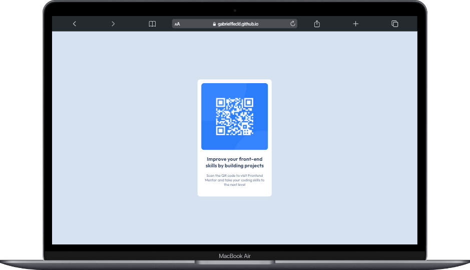
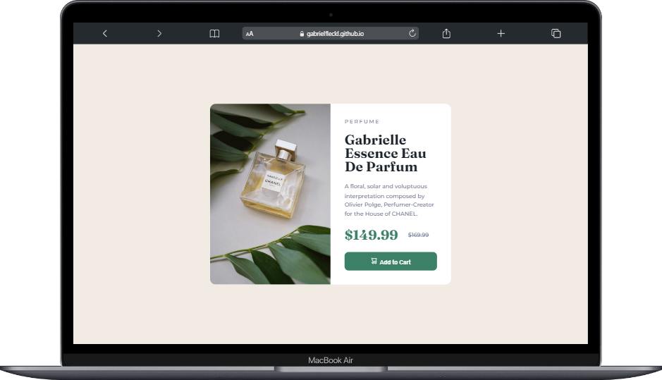
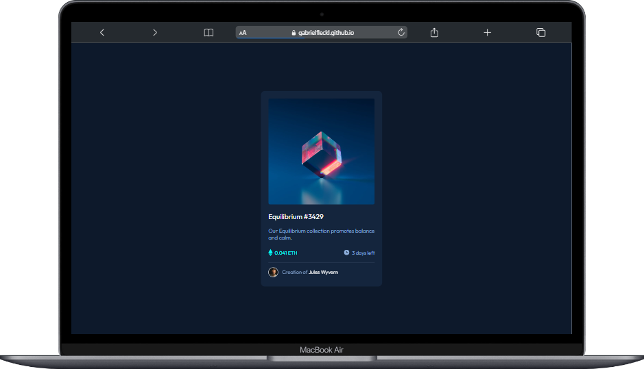
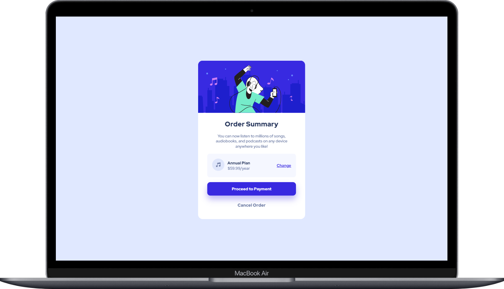
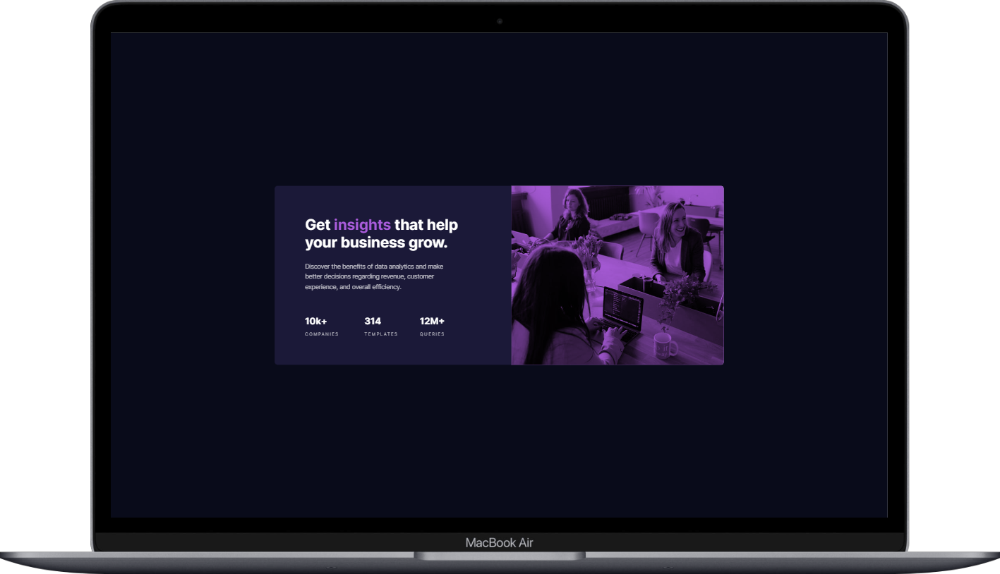

<h1 align="center">
  Desafios Front End Mentor
</h1>

  <a href="#-desafios">Desafios</a>&nbsp;&nbsp;&nbsp;|&nbsp;&nbsp;&nbsp;
  <a href="#-licença">Licença</a>&nbsp;&nbsp;&nbsp;|&nbsp;&nbsp;&nbsp;
  <a href="#-contato">Contato</a>

 

## 💣 Desafios

Aqui você pode conferir os desafios em suas respectivas versões categorizados pela dificuldade. 
## Dificuldades
 

  
  

 

  <a href="#-novato">👶 Novato</a>    

  <a href="#-junior">😀 Junior </a>  

  <a href="#-intermediário">🙂 Intermediário</a>  

  <a href="#-avançado">😐 Avançado</a>  

  <a href="#-guru">😡 Guru</a>

 

## 👶 Novato

---

### Desafio 01 - Card com QR code.
 

[👉 Link para visualizar o desafio 01.](https://gabrielfleckl.github.io/desafios-front-end-mentor/QR-code/)

 
   

 

## 🚀 Tecnologias

Esse desafio foi desenvolvido com as seguintes tecnologias:

 
 

---

### Desafio 02 - Card de Produto.
 

[👉 Link para visualizar o desafio 02.](https://gabrielfleckl.github.io/desafios-front-end-mentor/product-preview-card-component-main/)

 
   

 

## 🚀 Tecnologias

Esse desafio foi desenvolvido com as seguintes tecnologias:

 
 

---

### Desafio 03 - Card NFT.
 

[👉 Link para visualizar o desafio 03.](https://gabrielfleckl.github.io/desafios-front-end-mentor/nft-preview-card-component-main/)

 
   

 

## 🚀 Tecnologias

Esse desafio foi desenvolvido com as seguintes tecnologias:

 
 

---

### Desafio 04 - Componente de Compra.
 

[👉 Link para visualizar o desafio 04.](https://gabrielfleckl.github.io/desafios-front-end-mentor/order-summary-component-main/)

 
   

 

## 🚀 Tecnologias

Esse desafio foi desenvolvido com as seguintes tecnologias:

 
 

---

### Desafio 05 - Card de Status.
 

[👉 Link para visualizar o desafio 04.](https://gabrielfleckl.github.io/desafios-front-end-mentor/order-summary-component-main/)

 
   

 

## 🚀 Tecnologias

Esse desafio foi desenvolvido com as seguintes tecnologias:

 
 

---

 

## 📝 Licença

Esse projeto está sob a licença MIT. Veja o arquivo [LICENSE](LICENSE) para mais detalhes.

 

## 🌐 Contato

 

---

Feito com ♥ by Gabriel Gonçalves 🖖 &nbsp;&nbsp;&nbsp;|&nbsp;&nbsp; <a href="#--desafios-front-end-mentor">Voltar para o Inicio ⬆️ </a>
 
